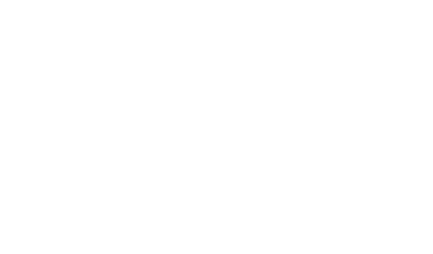

# WAV:FORM

## Hack Club Roulette Spins

- **Camera:** 2D Side Scrolling
  - The game primarily involves you the player scrolling through a song, with it's waveform at the bottom of the screen.
- **Gameplay:** Survival
  - The aim of the game is to survive the onslaught of lazers the waveforms shoot at you. This is where I took inspiration from Touhou/ bullet hell games.
- **Setting:** Surreal
  - I just spammed a bunch of visualizers and made the screen all shaky. I thought that was trippy enough.
